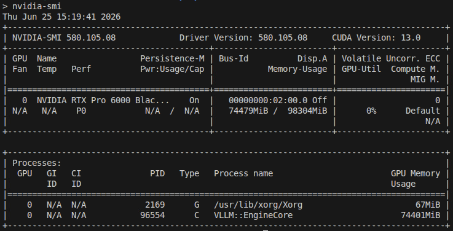
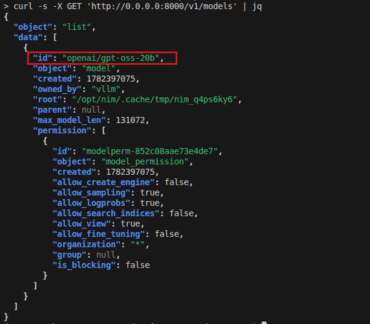
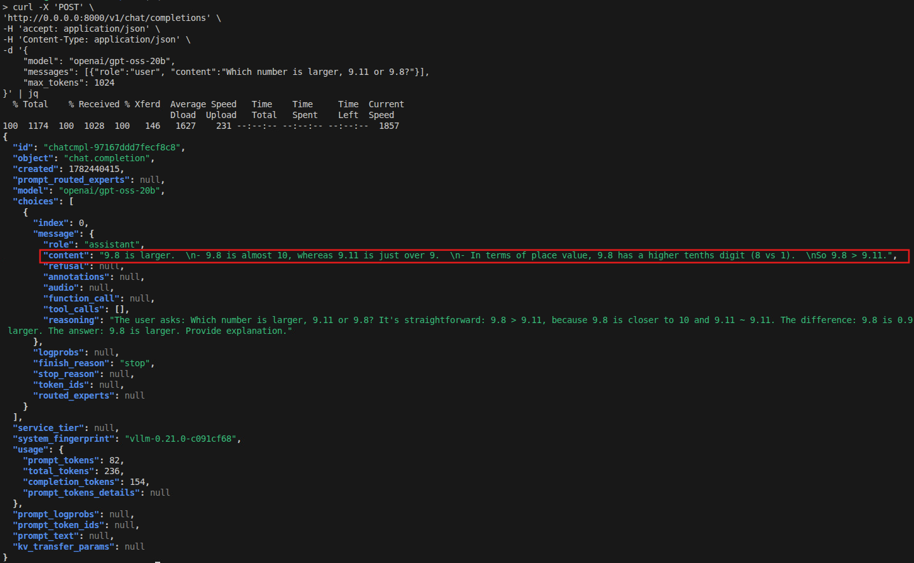
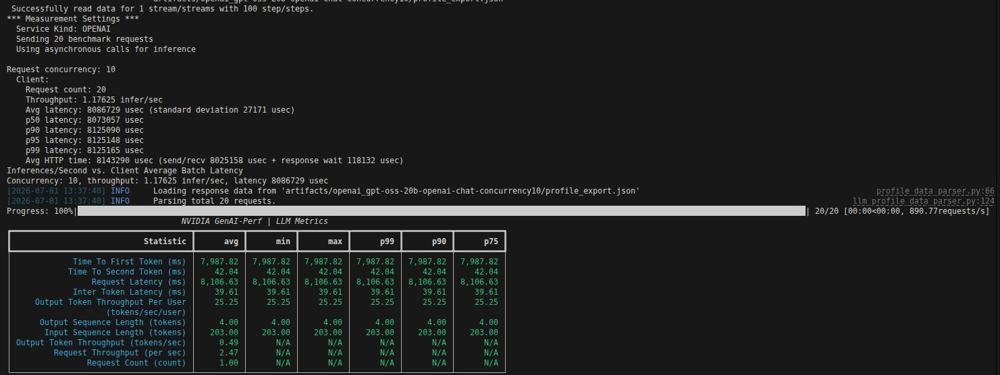

# 🧪 Lab Guide 01: Running NVIDIA NIM and GenAI-Perf Benchmark
This guide will walk you through setting up a GPT-OSS 20B model on NIM and running a GenAI-Perf benchmark using Triton Server.
You’ll learn how to configure the environment, launch the container, inference with the NVIDIA NIM container.

---

## 🧩 Prerequisites

Before starting, ensure you have the following:

* **Docker** (with NVIDIA Container Toolkit installed)
* **NGC API key** (for accessing NVIDIA’s NGC registry)
* **GPU-enabled system**

---

## 1. Running the NIM Model

### Step 1: Set Up Local Nim Cache

First, set up a local cache directory for NIM.

```bash
export LOCAL_NIM_CACHE=~/.cache/nim
mkdir -p "$LOCAL_NIM_CACHE"
```

### Step 2: List Available Model Profiles

You can list the available model profiles for the desired model using the following command.

```bash
docker run --rm --runtime=nvidia --gpus=all \
    -e NGC_API_KEY=$NGC_API_KEY \
    nvcr.io/nim/openai/gpt-oss-20b:2.0.6 \
    list-model-profiles
```
### Step 3: Start the Model Server

Run the GPT-OSS-20B Model on NIM in detached mode.

```bash
docker run -itd --name=gpt-oss-20b --rm \
    --gpus all \
    --shm-size=16GB \
    -e NGC_API_KEY \
    -v "$LOCAL_NIM_CACHE:/opt/nim/.cache" \
    -u $(id -u) \
    -p 8000:8000 \
    nvcr.io/nim/openai/gpt-oss-20b:2.0.6
```

It will take a while for the model to be deployed (around 1~5 mins). Run the following command to continuously check for GPU utilization, and you should see something like the following:
```bash
watch nvidia-smi
```


Press `CTRL + C` to go back and proceed to step 4.

### Step 4: Test the Model Endpoint

To verify that the model server is running, send a `GET` request to list the available models.

```bash
curl -s -X GET 'http://0.0.0.0:8000/v1/models' | jq
```



### Step 5: Test Model Response

You can now test the model by sending a `POST` request with a sample input.

```bash
curl -X 'POST' \
'http://0.0.0.0:8000/v1/chat/completions' \
-H 'accept: application/json' \
-H 'Content-Type: application/json' \
-d '{
    "model": "openai/gpt-oss-20b",
    "messages": [{"role":"user", "content":"Which number is larger, 9.11 or 9.8?"}],
    "max_tokens": 1024
}' | jq
```
You should see the following response, the LLM response is under the `content` field:


## 2. Running GenAI-Perf Benchmark

### Step 6: Copy the Tokenizer for GPT-OSS-20B

Set the tokenizer for the GPT-OSS-20B model.

```bash
export HF_TOKENIZER=~/tokenizer
```

### Step 7: Export Variables and Run Triton Server

Set the environment variables and run the Triton Server.

```bash
export RELEASE="26.06" # Use the latest releases in yy.mm format
export WORKDIR=~/genai-perf
mkdir -p "$WORKDIR"
docker run -it --rm --net=host --gpus=all \
    -v $WORKDIR:/workdir \
    -v $HF_TOKENIZER:/root/.cache/huggingface \
    nvcr.io/nvidia/tritonserver:${RELEASE}-py3-sdk
```

### Step 8: Run GenAI-Perf Benchmark

Run the GenAI-Perf benchmark script on the Triton Server. Allow approximately 30 seconds for the script to complete.

```bash
export INPUT_SEQUENCE_LENGTH=200
export INPUT_SEQUENCE_STD=10
export OUTPUT_SEQUENCE_LENGTH=200
export CONCURRENCY=10
export MODEL=openai/gpt-oss-20b

cd /workdir
genai-perf \
    -m $MODEL \
    --endpoint-type chat \
    --service-kind openai \
    --streaming \
    -u localhost:8000 \
    --synthetic-input-tokens-mean $INPUT_SEQUENCE_LENGTH \
    --synthetic-input-tokens-stddev $INPUT_SEQUENCE_STD \
    --concurrency $CONCURRENCY \
    --output-tokens-mean $OUTPUT_SEQUENCE_LENGTH \
    --extra-inputs max_tokens:$OUTPUT_SEQUENCE_LENGTH \
    --extra-inputs min_tokens:$OUTPUT_SEQUENCE_LENGTH \
    --extra-inputs ignore_eos:true \
    --tokenizer openai/gpt-oss-20b \
    -- \
    -v \
    --max-threads=256
```
The benchmark can take up to few minutes, in which once done you will see the following reference benchmark output:



---

### Step 9: Exit out of container

Exit out of the current trition container:

```bash
exit
```

## 📝 Summary

Congratulations! 🎉 You successfully launched the OpenAI GPT-OSS 20B model on NIM, tested it with sample queries, set up Triton Server, and ran a GenAI‑Perf benchmark to measure performance


---
