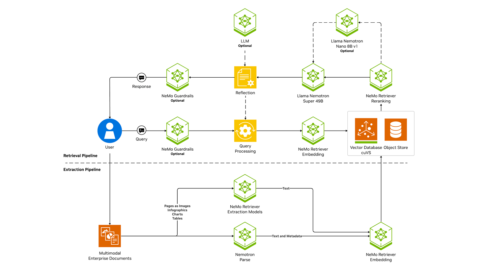
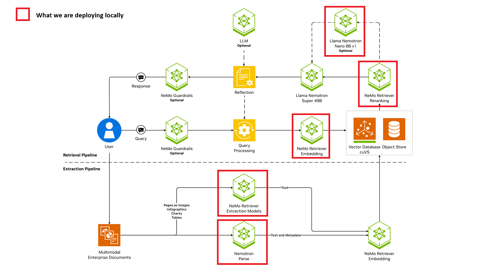
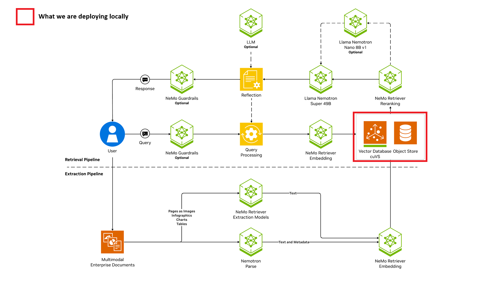
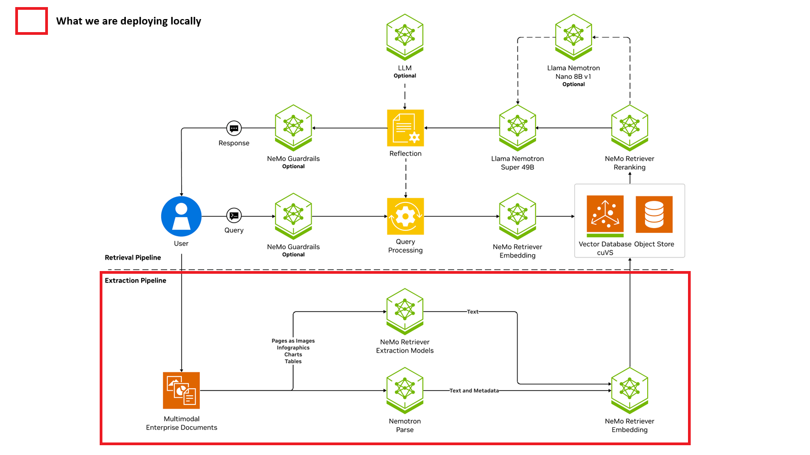
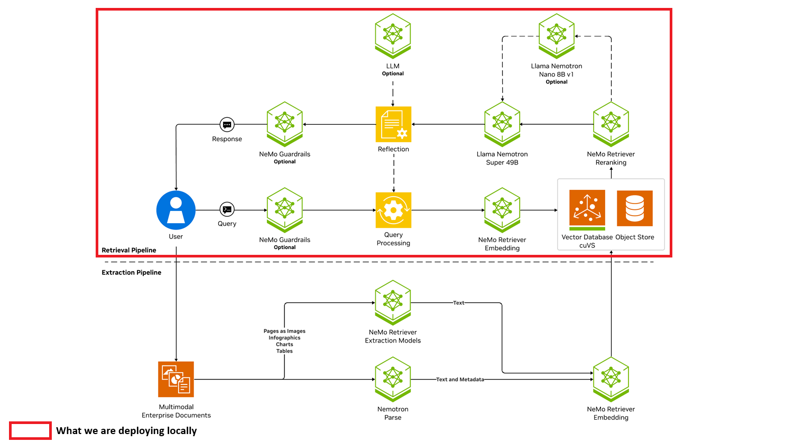
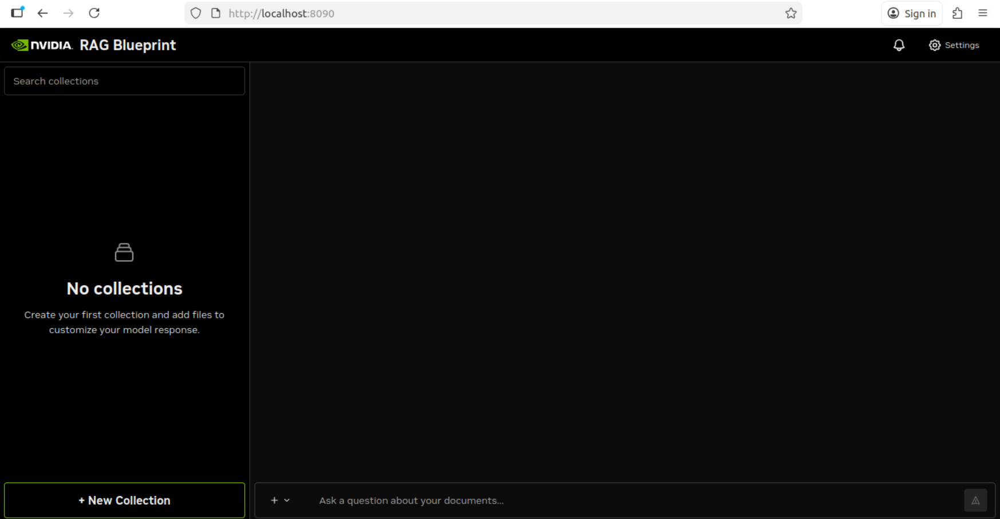
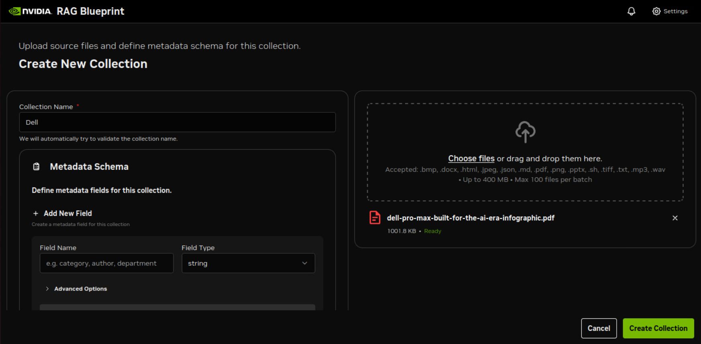
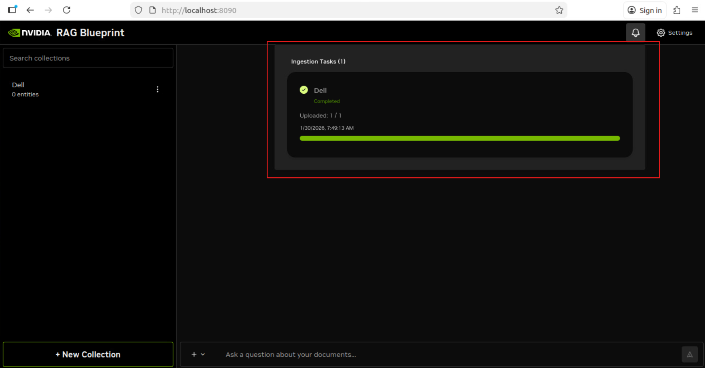
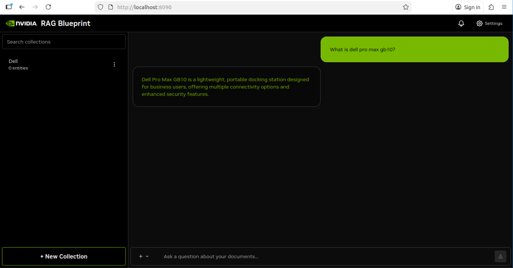
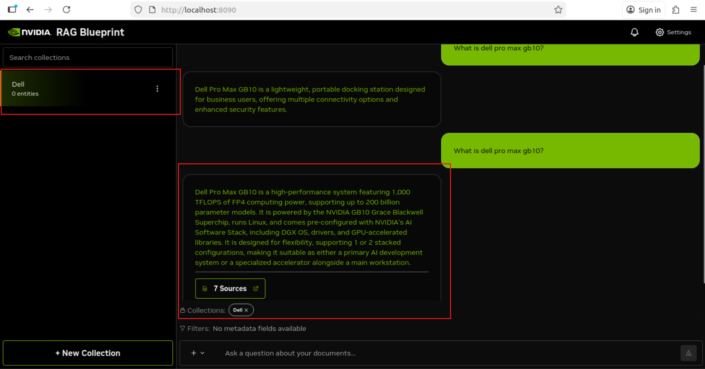

# Lab 03 - Get Started With the NVIDIA Blueprints - Enterprise RAG Blueprint

In this walkthrough you deploy the NVIDIA RAG Blueprint with Docker Compose for a single node deployment, and using self-hosted on-premises models.

Here is the architecture diagram of the Enterprise RAG Blueprint (we are NOT going to deploy all components):



## Prerequisites

To pull images required by the blueprint from NGC, you must first authenticate Docker with nvcr.io. Use the NGC API Key you created in the first step.

```bash
echo "${NGC_API_KEY}" | docker login nvcr.io -u '$oauthtoken' --password-stdin
```

## Stop All Running Containers

Before starting this lab, it’s best to stop any previously running containers to avoid port conflicts or GPU contention.

```bash
docker stop $(docker ps -q)
```

This command stops all running Docker containers.
If no containers are running, you’ll see a harmless error message.

---

## Start services using self-hosted on-premises models

Use the following procedure to start all containers needed for this blueprint.

1. Clone git repository and cd into it:

   ```bash
   git clone https://github.com/leewaileongjames/rag.git rag-blueprint && cd rag-blueprint
   ``` 

2. Create a directory to cache the models and export the path to the cache as an environment variable.

   ```bash
   mkdir -p ~/.cache/model-cache
   export MODEL_DIRECTORY=~/.cache/model-cache
   ```


3. Export all the required environment variables to use on-prem models.

   ```bash
   source deploy/compose/.env
   ```

4. Start all required NIMs by running the following code.

   

<br/>

   > [!WARNING]  
   > Do not attempt this step unless you have completed the previous steps.

<br/>

   ```bash
   USERID=$(id -u) docker compose -f deploy/compose/nims.yaml up -d
   ```

   The NIM LLM service can take 30 mins to start for the first time as the model is downloaded and cached. Subsequent deployments can take 2-5 minutes, depending on the GPU profile.

   > [!TIP]  
   > The models are downloaded and cached in the path specified by `MODEL_DIRECTORY`.

6. Check the status of the deployment by running the following code. Wait until all services are up and the `nemoretriever-ranking-ms` and `nemoretriever-embedding-ms` NIMs are in healthy state before proceeding further.

     ```bash
     watch -n 2 'docker ps --format "table {{.Names}}\t{{.Status}}"'
     ```
    Your output should look similar to the following.

     ```output
        NAMES                                   STATUS

        nemoretriever-ranking-ms                Up 14 minutes (healthy)
        compose-page-elements-1                 Up 14 minutes
        compose-paddle-1                        Up 14 minutes
        compose-graphic-elements-1              Up 14 minutes
        compose-table-structure-1               Up 14 minutes
        nemoretriever-embedding-ms              Up 14 minutes (healthy)
     ```


7. Start the vector db containers from the repo root.
  
   

   ```bash
   docker compose -f deploy/compose/vectordb.yaml up -d
   ```


7. Start the ingestion containers from the repo root. This pulls the prebuilt containers from NGC and deploys them on your system.
  
   

   ```bash
   docker compose -f deploy/compose/docker-compose-ingestor-server.yaml up -d
   ```

   You can check the status of the ingestor-server and running the following code.

   ```bash
   curl -X 'GET' 'http://localhost:8082/v1/health?check_dependencies=true' -H 'accept: application/json' | jq
   ```

    You should see output similar to the following.

    ```bash
    {
        "message": "Service is up.",
        "databases": [
            ...
        ],
        "object_storage": [
            ...
        ],
        "nim": [
            {
                "service": "Embeddings",
                "status": "healthy",
                ...
            },
            {
                "service": "Summary LLM",
                "status": "healthy",
                ...
            }
        ],
        "processing": [
            {
                "service": "NV-Ingest",
                "status": "healthy",
                ...
            }
        ],
        "task_management": [
            {
                "service": "Redis",
                "status": "healthy",
                ...
            }
        ]
    }
    ```


8. Start the RAG containers from the repo root. This pulls the prebuilt containers from NGC and deploys them on your system.

   

    ```bash
    docker compose -f deploy/compose/docker-compose-rag-server.yaml up -d
    ```

    You can check the status of the rag-server by running the following code.

    ```bash
    curl -X 'GET' 'http://localhost:8081/v1/health?check_dependencies=true' -H 'accept: application/json' | jq
    ```

    You should see output similar to the following.

    ```bash
    {
        "message": "Service is up.",
        "databases": [
            ...
        ],
        "object_storage": [
            ...
        ],
        "nim": [
        {
            "service": "LLM",
            "status": "healthy",
            ...
        },
        {
            "service": "Embeddings",
            "status": "healthy",
            ...
        },
        {
            "service": "Ranking",
            "status": "healthy",
            ...
        }
      ]
    }
    ```


9. Check the status of the deployment by running the following code.

    ```bash
    docker ps --format "table {{.ID}}\t{{.Names}}\t{{.Status}}"
    ```

    You should see output similar to the following. Confirm all the following containers are running.

    ```output
    NAMES                                   STATUS
    compose-nv-ingest-ms-runtime-1          Up 5 minutes (healthy)
    ingestor-server                         Up 5 minutes
    compose-redis-1                         Up 5 minutes
    rag-frontend                            Up 9 minutes
    rag-server                              Up 9 minutes
    milvus-standalone                       Up 36 minutes
    milvus-minio                            Up 35 minutes (healthy)
    milvus-etcd                             Up 35 minutes (healthy)
    nemoretriever-ranking-ms                Up 38 minutes (healthy)
    compose-page-elements-1                 Up 38 minutes
    compose-paddle-1                        Up 38 minutes
    compose-graphic-elements-1              Up 38 minutes
    compose-table-structure-1               Up 38 minutes
    nemoretriever-embedding-ms              Up 38 minutes (healthy)
    ```


## Experiment with the Web User Interface

After the RAG Blueprint is deployed, you can use the RAG UI to start experimenting with it.

1. Open a web browser and access the RAG UI at 
<a href="http://localhost:8090" target="_blank" rel="noopener noreferrer">
    http://localhost:8090
</a>. 
You can start experimenting by uploading docs and asking questions.


    

2. Click on `New Collection` at the bottom left to create a collection and upload files. We have included a `Dell Pro Max infographic pdf` located within the `~/Desktop`, you can use that as a sample (or upload any other pdf / txt file if you'd prefer).

    

3. Wait for the ingestion to be complete, the time taken to ingest depends on how much information is in your uploaded files:

    

4. Begin asking questions related to the files you have ingested. Lets try asking a question without activating RAG:

    

5. Finally, lets try selecting the collection and asking the same question:

    

6. Congratulations! 🎉 You have successfully deployed entire solution architectures efficiently and easily with NVIDIA AI Blueprints 🎉.

## Shut down services

1. To stop all running services, run the following code.

    ```bash
    docker compose -f deploy/compose/docker-compose-ingestor-server.yaml down
    docker compose -f deploy/compose/nims.yaml down
    docker compose -f deploy/compose/docker-compose-rag-server.yaml down
    docker compose -f deploy/compose/vectordb.yaml down
    ```
